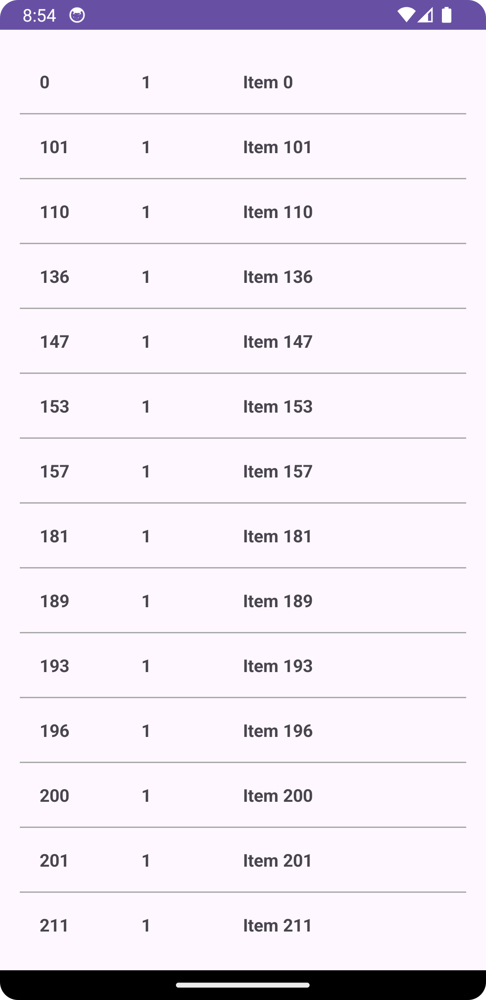

# fetch-app
Reporitory for Fetch Hiring App

# Project Configuration

* Android Studio version - 8.2.1
* Minimum SDK Version - 24
* Target SDK Version - 34
* JAVA Version - 8

# Running on Local

To run the app on local, follow the steps listed below - 
* Clone the repository on your local machine
* Open the folder as a project in Android Studio
* As soon as the configurations load, run the app

The interface should look like this -
